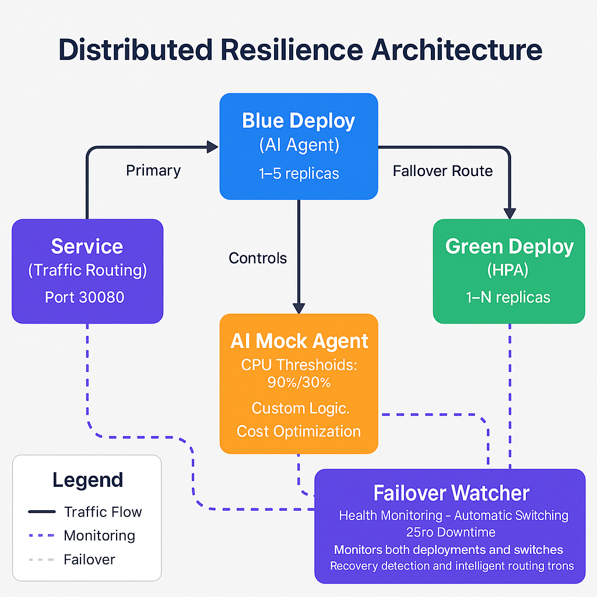

# Distributed Resilience Demo: Production-Grade Kubernetes

**Design Kubernetes systems that withstand failure—even under extreme conditions.**

This repository is a complete, hands-on lab for building production-grade resilience in Kubernetes. It moves beyond introductory examples to explore advanced patterns that enable infrastructure to be intelligent, autonomous, and cost-aware. The project is inspired by the talk *"Distributed Resilience: How to Design Systems That Don't Fail (Even When Everything Else Does)"*, and serves as a practical blueprint for creating systems that recover gracefully, adapt to changing conditions, and continue operating effectively even when critical components are under stress.

---

## Why This Demo Matters

Many Kubernetes demonstrations stop at basic deployments or simple autoscaling. This one is different: the emphasis is on survivability and autonomy. The scenarios guide you in creating a platform that does more than respond to failure—it anticipates it. You will see how to build decision-making into the platform so it understands business priorities, weighs cost implications, and adjusts automatically to preserve service continuity. The result is an architecture that can recover without human intervention, scale intelligently based on context, and optimize for both performance and cost.

This is not just a proof of concept. The patterns here can be deployed, adapted, and expanded into real-world environments where downtime is unacceptable and efficiency matters.

---

## System Architecture



At the heart of the demo is a redundant, autonomous, and self-correcting design. Two identical deployments, blue and green, provide high availability. A central Kubernetes Service manages traffic routing and can instantly shift connections from one deployment to the other. The blue deployment is managed by a custom Python-based AI agent capable of predictive scaling, taking into account workload patterns, cost considerations, and business logic. In contrast, the green deployment uses Kubernetes’ Horizontal Pod Autoscaler, offering a reactive scaling model that responds to changes in CPU and memory usage. A dedicated failover watcher continuously monitors both environments and coordinates traffic switching when an unhealthy state is detected. This combination allows for immediate failover, proactive scaling decisions, and uninterrupted service delivery.

---

## What You Will Learn

Through the exercises in this repository, you will explore how intelligent failover differs from traditional service switching, compare reactive autoscaling with AI-driven predictive scaling, and experiment with realistic failure simulations. You will also see how financial considerations can be integrated directly into scaling strategies, ensuring that infrastructure decisions balance cost and performance. The demo can be run entirely offline, enabling you to focus on the architectural and operational principles without external dependencies.

---

## Quick Start

The environment can be deployed in a few straightforward steps. First, clone this repository and move into its directory:

```bash
git clone https://github.com/rsergio07/distributed-resilience-demo.git
cd distributed-resilience-demo
```

If you have previously deployed the demo, clean the environment before starting fresh:

```bash
./scripts/cleanup.sh --cluster
```

Deploy the offline version of the demo using:

```bash
./scripts/deploy-offline.sh
```

Once the scripts complete, verify the environment by listing the pods in the `distributed-resilience` namespace:

```bash
kubectl -n distributed-resilience get pods
```

When the system is ready, select a scenario from the runbooks and begin your exploration.

---

## Runbook Previews

The journey begins with the [**Blue/Green Failover with HPA**](./RUNBOOK_FAILOVER.md) scenario, where you’ll witness traditional autoscaling in action while also introducing intelligent traffic switching. This chapter is designed to build a strong foundation in resilient service management, showing how Kubernetes can scale workloads under varying demand and redirect traffic seamlessly during an outage. It is ideal for those new to advanced Kubernetes patterns who want to understand how reactive scaling and intelligent failover complement each other.

From there, the experience evolves into the [**AI-Driven Autoscaling**](./RUNBOOK_AUTOSCALING.md) scenario, which shifts the focus from reacting to predicting. Here you will integrate a custom Python agent capable of making cost-aware scaling decisions based on historical trends and operational priorities. This chapter demonstrates how infrastructure can move beyond predefined thresholds, applying business logic to manage resources more strategically. It is suited for teams exploring AI-enhanced operations and autonomous infrastructure control.

Both scenarios are supported by dedicated runbooks that contain the step-by-step execution details, allowing the README to remain focused on the concepts and flow while the runbooks handle the procedures.

---

## Experiment Ideas

The runbooks provide a structured starting point, but the real value comes when you push the system beyond its default boundaries. You might introduce artificial network latency to see how the failover watcher behaves when performance degrades rather than fails outright. Another worthwhile experiment is to adjust the AI agent’s cost parameters, simulating a scenario where budget constraints become as important as performance, and observing how scaling decisions change in response.

For those interested in chaos engineering principles, you could deliberately crash only part of a deployment, leaving some pods running but in a degraded state, and evaluate whether the system recognizes the partial failure quickly enough to trigger corrective action. Testing in different cluster sizes and node configurations can also reveal how well the resilience patterns scale, and whether the AI agent adapts as effectively in smaller or more resource-constrained environments.

These experiments are not just stress tests—they are opportunities to refine your understanding of how resilient architecture behaves under varying operational realities, and to identify the thresholds at which proactive measures are triggered versus reactive ones.

---

## Operational Metrics

Resilience is only meaningful if it can be measured. Throughout the demo, you can track key metrics that reveal how well the system performs under stress. Failover time measures how quickly the platform detects an unhealthy deployment and redirects traffic to a healthy one. Scaling latency shows the interval between a workload trigger and the moment new capacity is available, providing insight into both HPA responsiveness and AI agent prediction accuracy.

Cost per request is another important indicator, especially in the AI-driven scenario where budget constraints influence scaling behavior. By observing how this metric changes before and after scaling events, you can assess whether the system is optimizing for financial efficiency without compromising performance. Additionally, you can monitor service error rates during failure simulations to understand the user impact and validate that recovery mechanisms are functioning as intended.

Together, these metrics turn the demo into more than a visual exercise—they provide a quantifiable view of resilience, making it easier to justify design decisions and identify areas for improvement.

---

## Real-World Applications

The patterns demonstrated in this demo are not limited to a controlled lab. In industries such as finance, where transaction processing must remain uninterrupted, intelligent failover ensures that trading platforms or payment systems can survive sudden node failures or traffic surges without user-visible downtime. In retail and e-commerce, AI-driven scaling can be used to prepare for predictable events such as seasonal sales, increasing capacity in advance based on historical demand while keeping operational costs under control.

SaaS providers can integrate similar architectures to maintain service availability across multiple regions, automatically rebalancing workloads when a data center experiences latency or partial outages. Even public sector systems—where budget oversight is as important as uptime—can benefit from cost-aware scaling policies that keep infrastructure lean without sacrificing reliability.

Because the underlying mechanisms are built on Kubernetes, these principles apply to any environment that values availability, efficiency, and adaptability. Whether your workloads run in the cloud, on-premises, or in hybrid deployments, the same core concepts can be adapted to meet organizational priorities while preserving operational excellence.

---

## Limitations and Next Steps

While this demo presents a solid foundation for designing resilient Kubernetes systems, it does operate within certain boundaries. The AI agent, for example, is tailored for this lab environment and does not yet integrate with external telemetry sources such as enterprise observability platforms or cloud cost APIs. Its decision-making models are simplified to ensure reproducibility in offline mode, meaning real-world deployments would require deeper integration and more sophisticated prediction models.

The failover watcher in this implementation is cluster-scoped and assumes a single namespace for simplicity. In production, you would likely extend its scope to multiple namespaces, clusters, or even cross-cloud failover scenarios. Similarly, while the architecture supports offline execution, many production workloads depend on continuous integration with external systems—adding such dependencies introduces complexity that is beyond the current lab’s scope.

Future enhancements could include integrating with Prometheus and Grafana for richer metric analysis, adding automated chaos experiments using tools like LitmusChaos or Chaos Mesh, and introducing multi-cluster federation to handle region-wide failures. Extending the AI logic to consider security posture, compliance constraints, and workload classification would also bring the architecture closer to production-grade decision-making.

By addressing these areas, the lab can evolve from a controlled demonstration into a fully deployable blueprint for intelligent, autonomous, and cost-efficient Kubernetes infrastructure.

---

## Additional Resources

Beyond the runbooks, you will find a set of supporting tools and materials that make experimentation easier. Deployment and cleanup scripts automate environment setup and teardown, ensuring a consistent lab experience every time. The architecture diagram serves as a visual reference for the interactions between components, and offline mode enables the entire environment to run without external dependencies—ideal for controlled lab networks or training environments.

For guidance on how to contribute improvements or suggest changes, see the [**Contributing Guidelines**](./CONTRIBUTING.md).
For license terms and usage permissions, refer to the [**License**](./LICENSE.md).

---