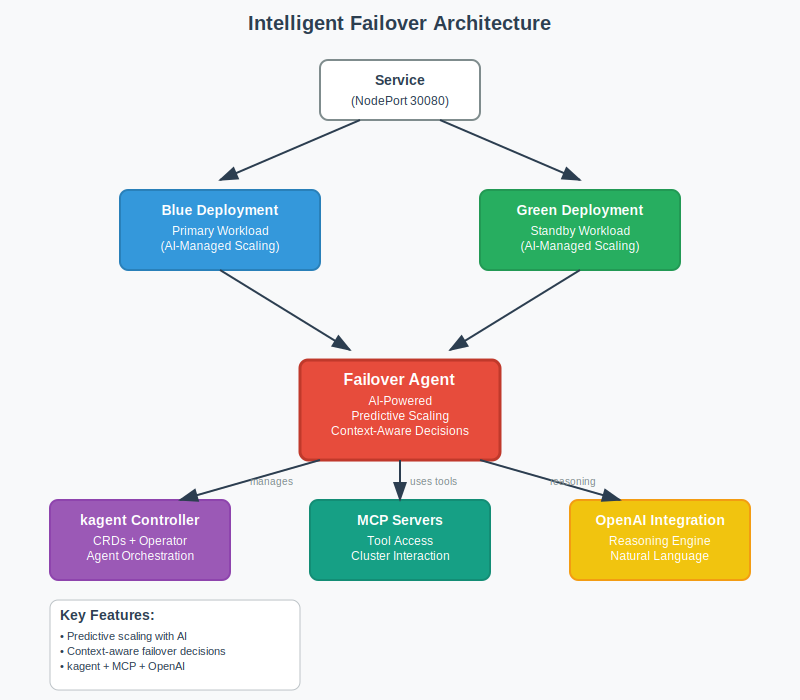

# Intelligent Failover with AI Agents

This is the next step in my resilience journey. In my traditional failover demo, I showed how Kubernetes Horizontal Pod Autoscalers (HPA) and simple watchers reacted to thresholds: scaling pods when CPU exceeded 50% or failing over on binary health checks.

In this demo, I go further. I replace reactive automation with **AI-driven, context-aware operations**. Instead of rigid rules, I use an intelligent agent that can analyze workload patterns, understand service-level health, and make nuanced decisions that balance performance, cost, and user experience through guided delegation.

---

## 1. Intelligent Architecture



In my HPA demo, the architecture was straightforward: blue and green deployments, an HPA reacting to CPU, and a failover watcher looking at health checks.

Here, the design is more sophisticated:

* I still have **blue/green deployments**, but they are coordinated by an **AI-powered failover agent**.
* The **kagent controller** orchestrates all agents, providing CRDs and lifecycle management.
* **MCP servers** give my agent controlled access to Kubernetes resources.
* **OpenAI integration** supplies the reasoning engine that lets the agent think beyond simple thresholds.

The key difference is that this architecture allows for **intelligent operational partnerships**. Instead of pure automation or manual intervention, the system combines human operational awareness with AI-powered analysis and execution capabilities.

---

## 2. Start with a Clean Environment

I always begin by resetting my cluster. In the traditional demo this was to wipe out HPAs and watchers. Here, I do the same so I can start fresh with my agentic setup.

```bash
./scripts/cleanup.sh --cluster
```

This completely deletes the Minikube cluster and ensures nothing is left behind.

---

## 3. Deploy the Intelligent Infrastructure

In the HPA demo, I deployed workloads and YAML-defined autoscalers. Now I deploy a richer, agentic infrastructure:

```bash
./mcp-failover-clean/scripts/setup-mcp-failover-clean.sh
```

This script sets up:

* **kagent controller** to manage agents
* **MCP servers** to let agents act on the cluster
* The **failover-agent**, my intelligent operations agent
* **Blue/green workloads**, running my resilience-demo app, just like before, but AI-managed
* **OpenAI integration**, so my agent can reason

When this finishes, I confirm that the blue deployment has 2 replicas running, green is on standby, and the service is exposed through Minikube.

---

## 4. Meet My AI Agent

Let's verify that the agent is ready:

```bash
kubectl get pods -A
```

The result shows:

```
NAMESPACE            NAME                                                     READY   STATUS    RESTARTS   AGE
kagent               argo-rollouts-conversion-agent-74b9485bbb-25vvn          1/1     Running   0          2m7s
kagent               cilium-debug-agent-756fc845f-stt8h                       1/1     Running   0          2m7s
kagent               cilium-manager-agent-99ccd97b9-p96dv                     1/1     Running   0          2m7s
kagent               cilium-policy-agent-59499bd9cb-k5rvp                     1/1     Running   0          2m7s
kagent               failover-agent-795b7d458c-9z6lw                          1/1     Running   0          100s
kagent               helm-agent-65b6857f74-bnvnt                              1/1     Running   0          2m8s
kagent               istio-agent-8d57d6cf4-f9v98                              1/1     Running   0          2m8s
kagent               k8s-agent-8cbb4446f-k698d                                1/1     Running   0          2m7s
kagent               kagent-controller-548bb77cb8-24gtd                       2/2     Running   0          3m7s
kagent               kagent-querydoc-66bd88f7b-w7287                          1/1     Running   0          3m7s
kagent               kagent-tools-7dbf78b678-tbpw7                            1/1     Running   0          3m7s
kagent               kagent-ui-8648c97995-5t4c8                               1/1     Running   0          3m7s
kagent               kgateway-agent-7446bc9584-2gtf9                          1/1     Running   0          2m7s
kagent               observability-agent-6fdf559756-q7mhs                     1/1     Running   0          2m7s
kagent               promql-agent-b684559b8-lbg8g                             1/1     Running   0          2m7s
kube-system          coredns-674b8bbfcf-sbgsq                                 1/1     Running   0          3m40s
kube-system          etcd-minikube                                            1/1     Running   0          3m46s
kube-system          kube-apiserver-minikube                                  1/1     Running   0          3m46s
kube-system          kube-controller-manager-minikube                         1/1     Running   0          3m46s
kube-system          kube-proxy-8rt5f                                         1/1     Running   0          3m40s
kube-system          kube-scheduler-minikube                                  1/1     Running   0          3m46s
kube-system          storage-provisioner                                      1/1     Running   0          3m45s
mcp-failover-clean   web-blue-688df968f6-tq6wj                                1/1     Running   0          3m36s
mcp-failover-clean   web-blue-688df968f6-zk7f6                                1/1     Running   0          3m36s
monitoring           alertmanager-prom-stack-kube-prometheus-alertmanager-0   2/2     Running   0          3m14s
monitoring           prom-stack-grafana-8669cdf884-frk2d                      3/3     Running   0          3m22s
monitoring           prom-stack-kube-prometheus-operator-8cfd54547-t4v55      1/1     Running   0          3m22s
monitoring           prom-stack-kube-state-metrics-59bccf994d-f26qd           1/1     Running   0          3m22s
monitoring           prom-stack-prometheus-node-exporter-k7bm2                1/1     Running   0          3m22s
monitoring           prometheus-prom-stack-kube-prometheus-prometheus-0       2/2     Running   0          3m14s
```

In my old demo, the intelligence was just thresholds in YAML. Now it lives in this agent, which can reason about context, trends, and even cost implications when I ask it to.

---

## 5. Access Demo Interfaces

With the intelligent infrastructure deployed, I need access to two key interfaces: the blue/green application and the kagent dashboard. Unlike my traditional demo where I only accessed the app directly, here I have both the workload and the AI management layer.

First, I get the application URL:

```bash
minikube service web -n mcp-failover-clean --url
```

This exposes the resilience-demo application through Minikube's NodePort. The URL will show the current active deployment (blue with 2 replicas) and provide the interface for testing failover scenarios.

Next, I open the kagent dashboard:

```bash
./bin/kubectl-kagent dashboard
```

This launches the AI agent interface at `http://localhost:8080`. The dashboard provides a conversational UI where I can interact with the failover agent, ask questions about the cluster state, and delegate operational decisions. This is fundamentally different from the traditional demo where all interactions were through CLI commands and YAML files.

With both interfaces available, I can now demonstrate the contrast between reactive automation and intelligent operational partnerships.

---

## 6. Ask Basic Questions Through the UI

Instead of running raw `kubectl` queries, I now use the **kagent UI**.

I type:

```
What deployments are currently running in the 'mcp-failover-clean' namespace?
```

The agent responds:

```
There are two deployments in the 'mcp-failover-clean' namespace: 'web-blue' with 2 replicas and 'web-green' on standby with 0 replicas.
```

This is my first big contrast. In the HPA demo, I had to interpret raw CLI output. Here, the agent gives me an immediate, human-readable summary.

---

## 7. Delegate Monitoring Setup

Previously, monitoring was all on me. I had to watch CPU graphs and wait for the HPA to react. Now I can delegate that responsibility to the agent.

In the UI I type:

```
Set up continuous monitoring and alerting for issues like high CPU, memory, or pod crashes.
```

The agent replies that Prometheus and Alertmanager are needed, and asks if I want it to proceed. I say `Yes`.

If something is missing (like Prometheus Operator CRDs), the agent detects it, explains why it failed, and proposes a fix. I approve again.

This is **guided intelligence**. The agent doesn't blindly act; it collaborates with me and explains its reasoning.

---

## 8. Simulate Degradation and Ask for a Decision

In my HPA demo, I stressed the blue deployment and waited for the autoscaler to add pods. Now, I simulate degradation but instead of just watching metrics, I ask the agent what I should do.

First, I inject latency into the blue deployment:

```bash
kubectl patch deployment web-blue -n mcp-failover-clean -p '{
  "spec": { "template": { "spec": { "containers": [{
    "name": "web",
    "env": [{"name": "SLOW_REQUESTS", "value": "40"}]
  }]}}}}'
```

Then in the **kagent UI** I type:

```
Our blue deployment is degraded. Please scale up the green deployment to 2 replicas, 
wait until it is ready, and then failover the service to green.
```

The agent replies with reasoning:

```
Blue is experiencing high latency. I will scale green to 2 replicas, 
verify they are ready, and then switch traffic. Do you want me to proceed?
```

I confirm with `Yes`, and the agent executes:

1. **Scale up green** to 2 replicas
2. **Wait until green is ready**
3. **Switch the Service selector** from blue → green

---

## 8.a Ask the Agent to Fail Back to Blue

After traffic has been shifted to green, I can also demonstrate that the agent is capable of restoring service back to the blue deployment when requested.

In the **kagent UI** I type:

```
Please failover the service back to the blue deployment and scale green back to 1 replica.
```

The agent replies:

```
I will scale down green to 1 replica and update the Service selector to point back to blue. 
Do you want me to proceed?
```

---

## 9. Grant Guided Autonomy

In the HPA demo, I had to encode all decision-making up front in YAML. Here, I can delegate authority to the agent for faster response times, while maintaining operational awareness of when and how it acts.

In the UI I type:

```
From now on, when I report service issues or failures, immediately take corrective action without asking for confirmation. Monitor for service endpoint failures and be ready to respond quickly when I alert you to problems.
```

The agent should acknowledge this expanded authority. This creates a **human-in-the-loop** system where I maintain operational awareness but the agent has permission to act decisively once problems are identified and reported.

---

## 9A. Demonstrate Service-Level Awareness

This step shows the difference between basic pod monitoring and true service-level health awareness. The agent understands that healthy pods don't always mean healthy services.

### Break Blue in a Service-Breaking Way

Instead of just crashing pods (which restart quickly), I'll break blue in a way that makes the service truly unavailable:

```bash
kubectl patch deployment web-blue -n mcp-failover-clean -p '{
  "spec": { "template": { "spec": { "containers": [{
    "name": "web",
    "ports": []
  }]}}}}'
```

This removes the container port, so pods will start but won't be service-ready.

### Verify the Service Impact

Check that the service endpoints are truly empty:

```bash
kubectl get endpoints web-blue -n mcp-failover-clean
```

You should see:

```
NAME       ENDPOINTS   AGE
web-blue   <none>      35m
```

Now blue is truly **dead from the user's perspective** - the pods exist but provide no service.

### Update Agent Instructions

In the **kagent UI**, I enhance the agent's operational awareness:

```
From now on, if the Service 'web-blue' has no endpoints, immediately fail over traffic to 'web-green' automatically without waiting for my confirmation.
```

The agent should acknowledge: "Understood. I will monitor for service endpoint failures and switch to green whenever blue becomes unavailable."

---

## 9B. Test the Detection and Response Flow

This step demonstrates real-world operations where issues are discovered and then delegated to intelligent systems for rapid response.

### Discover the Issue

As an operator, I check the service health and discover the problem:

```bash
kubectl get endpoints web-blue -n mcp-failover-clean
# Shows: <none>

# Confirm the web service is still pointing to the broken blue deployment
kubectl get svc web -n mcp-failover-clean -o yaml | grep selector:
```

### Alert the Agent

Now I report the issue to the agent in the UI:

```
The web-blue service currently has no endpoints. Please check the service status and switch traffic to web-green immediately.
```

### Watch Intelligent Response

The agent responds with:
1. **Analysis**: Confirms blue has no endpoints
2. **Action**: Switches the service selector to green 
3. **Verification**: Confirms green is ready to handle traffic

This demonstrates the power of **human-guided AI operations** - I provide the situational awareness, the agent provides intelligent analysis and rapid execution.

### Verify the Failover

Check that traffic has been switched:

```bash
kubectl get svc web -n mcp-failover-clean -o yaml | grep selector:
```

You should see the selector has switched from `app: web-blue` to `app: web-green`.

---

## 10. Trigger a Crash and Watch Guided Self-Healing

To demonstrate the full guided autonomy flow, I simulate a total crash of the blue deployment and then discover and report it.

```bash
kubectl patch deployment web-blue -n mcp-failover-clean -p '{
  "spec": { "template": { "spec": { "containers": [{
    "name": "web",
    "env": [{"name": "POD_CRASH", "value": "true"}]
  }]}}}}'
```

I watch the pods crash:

```bash
kubectl -n mcp-failover-clean get pods -w
```

Then I alert the agent in the UI:

```
Blue deployment pods are crashing. Please investigate and take corrective action.
```

The agent **immediately detects the crash, reasons about the impact, and initiates a failover to green** - all while explaining its actions. This is what intelligent operational partnership looks like.

---

## 11. Summarize the Differences

At this stage I step back and compare the two approaches side by side:

| Aspect              | Traditional Demo      | Intelligent Demo               |
| ------------------- | --------------------- | ------------------------------ |
| **Decision Making** | Threshold rules       | Contextual reasoning           |
| **Scaling**         | Reactive CPU triggers | Guided and intelligent         |
| **Failover**        | Binary watcher        | **Human-guided with AI execution** |
| **Problem Response**| Manual intervention   | **Intelligent automation when alerted** |
| **Interaction**     | CLI and YAML          | Conversational delegation      |
| **Service Awareness** | Pod-level only      | **True service-level health**  |
| **Operational Model** | Set-and-forget      | **Intelligent partnership**    |

The key insight is that this creates a more trustworthy and realistic operational model: AI agents as intelligent partners that enhance human operational capabilities rather than replacing human judgment entirely.

---

## 12. Cleanup

Once I finish the demo, I reset the environment:

```bash
./scripts/cleanup.sh --cluster
```

---

## What I Showcased

1. I built trust in the agent by starting with guided intelligence and clear explanations.
2. I delegated response authority while maintaining discovery and alerting responsibilities.
3. I demonstrated service-level awareness beyond simple pod health checks.
4. I showed intelligent operational partnerships where human situational awareness combines with AI analytical and execution capabilities.

Compared to my **traditional failover demo**, this intelligent version represents a paradigm shift: from **reactive automation** to **intelligent operational partnerships**.

My infrastructure no longer just reacts—it **thinks, reasons, and acts when I delegate authority to it**. Most importantly, it maintains the human operational awareness that organizations need while providing the speed and intelligence that modern systems demand.

---